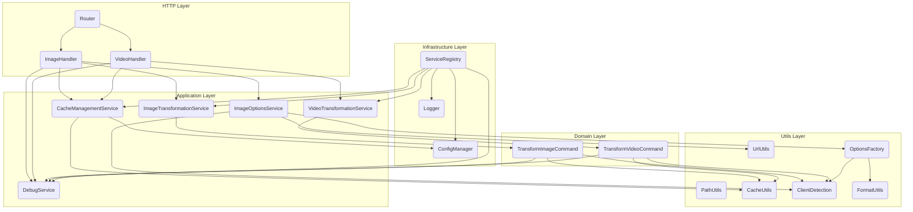
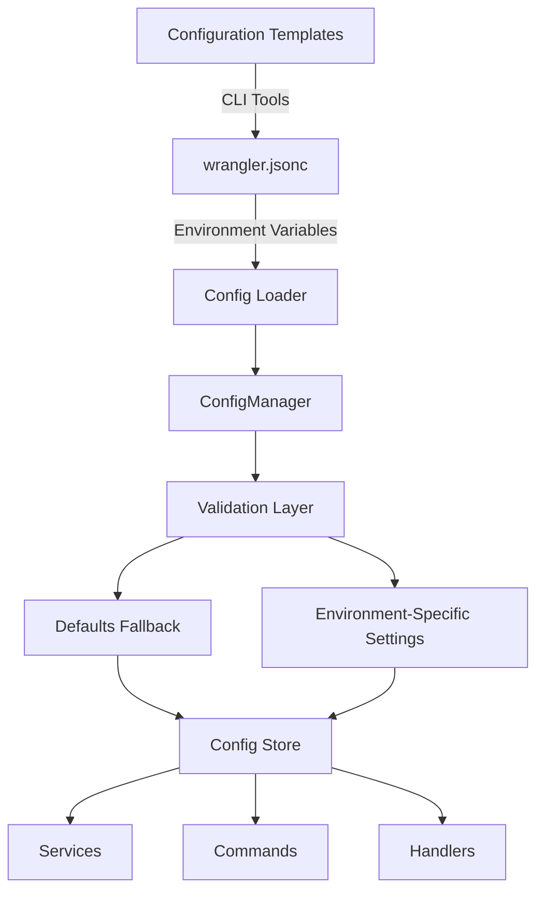
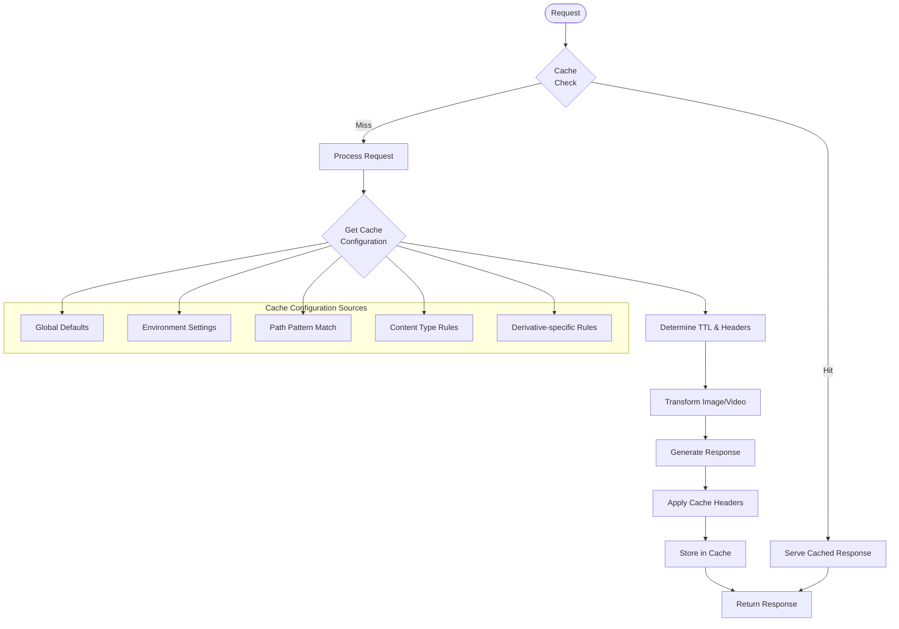
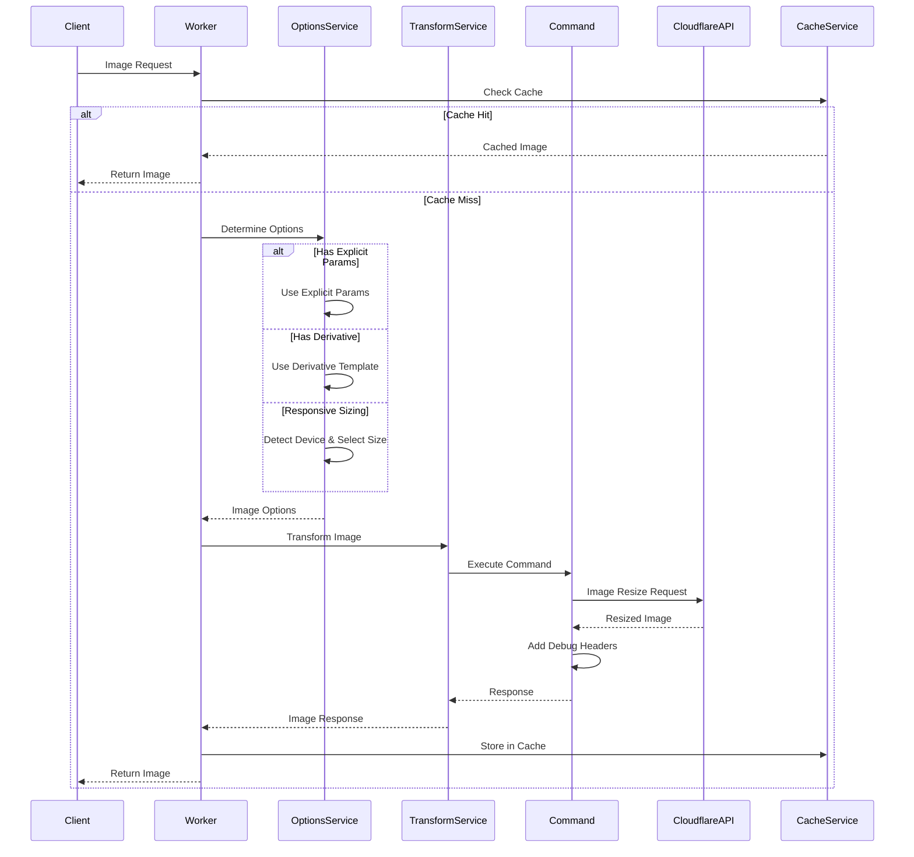

# Image Resizer Architecture

This document outlines the architecture of the image-resizer service, a Cloudflare Worker that optimizes images using Cloudflare's Image Resizing service.

## Table of Contents
- [Overview](#overview)
- [Architectural Patterns](#architectural-patterns)
- [Component Structure](#component-structure)
- [Configuration Management](#configuration-management)
- [Testing Strategy](#testing-strategy)
- [Deployment](#deployment)

## Overview

The image-resizer is a Cloudflare Worker that intercepts image requests and applies transformations using Cloudflare's Image Resizing service. It supports:

- Responsive image sizing based on device type and client hints
- Multiple image formats (WebP, AVIF, JPEG, PNG, etc.)
- Predefined transformation templates (called "derivatives")
- Path-based derivative detection
- Caching strategies
- Debugging capabilities

## Architectural Patterns

The codebase follows several architectural patterns:

### Domain-Driven Design (DDD)

- **Domain Model**: The core business logic is encapsulated in the `domain` directory
- **Commands**: Uses command pattern (e.g., `TransformImageCommand`) to encapsulate operations

### Service-Oriented Architecture

- **Services**: Functionality is organized into services like `imageTransformationService` and `cacheManagementService`
- **Handlers**: Request processing is managed by handlers that coordinate between services

### Strategy Pattern

- **OptionsFactory**: Uses strategies to determine how to create image transformation options
- **Derivatives**: Template-based strategies for common transformations

### Factory Pattern

- **OptionsFactory**: Centralizes creation of image options
- **Strategies**: Different strategies for creating options based on context

### Singleton Pattern

- **ConfigurationManager**: Ensures single source of truth for configuration

## Component Structure

### Visual Architecture



The codebase is organized into the following directories:

```
src/
├── config/             # Configuration management
├── domain/             # Domain model and commands
│   └── commands/       # Command pattern implementations
├── handlers/           # Request handlers
├── services/           # Service implementations
└── utils/              # Utility functions
```

### Key Components

#### Entry Point

- `index.ts`: The worker entry point that routes requests

#### Configuration

- `configManager.ts`: Centralized configuration management
- `imageConfig.ts`: Image-specific configuration

#### Domain Logic

- `TransformImageCommand.ts`: Implementation of the transform operation

#### Services

- `imageTransformationService.ts`: Handles image transformation
- `cacheManagementService.ts`: Manages caching
- `debugService.ts`: Provides debugging capabilities

#### Handlers

- `imageHandler.ts`: Main handler for image requests
- `imageOptionsService.ts`: Determines transformation options

#### Utilities

- `optionsFactory.ts`: Creates image options using strategy pattern
- `pathUtils.ts`: Path-related utilities
- `formatUtils.ts`: Format detection and conversion
- `urlParamUtils.ts`: URL parameter extraction

## Configuration Management

Configuration is managed through a combination of:

1. Factory-based `createConfigManager` function (preferred approach)
2. Legacy singleton `ConfigurationManager` class (for backward compatibility)

The configuration system:
- Loads configuration from environment variables
- Provides a centralized access point for all configuration
- Handles parsing of complex configuration objects
- Provides reasonable defaults when configuration is missing
- Supports JSON with comments (JSONC) format

### Configuration Flow



### Configuration Sources
- Environment variables from `wrangler.jsonc`
- Derivative templates (predefined transformations)
- Path patterns (URL matching patterns)
- Responsive configuration (device-specific settings)
- Caching configuration (TTL and cache behavior)
- Default values (as fallback)

### Tools and Utilities
- **Configuration CLI**: Command-line tool for managing configuration
  - Templates management
  - Validation
  - Migration from older formats
  - JSON/JSONC support
- **Configuration Assistant**: Helper utilities for common configuration tasks

## Caching Strategy

The image-resizer implements a sophisticated caching strategy:



The system supports two caching methods:
- **Cloudflare Cache API**: Explicit control with `caches.default`
- **CF Object Method**: Implicit caching via Cloudflare's fetch options

### Cache Keys
Cache keys are generated based on the URL's pathname and search parameters. When using Cloudflare's image resizing with the CF object method, resized images are automatically cached as variants under the original image's URL, following Cloudflare's best practices.

### Cache TTL Configuration
TTLs are configured based on:
- Status code category (2xx, 3xx, 4xx, 5xx)
- Content type
- Path patterns
- Environment settings

## Testing Strategy

The testing approach includes:

- **Unit Tests**: Testing individual components in isolation
- **Integration Tests**: Testing interaction between components
- **Factory Tests**: Ensuring factories create the correct objects
- **Configuration Tests**: Verifying configuration parsing
- **Strategy Tests**: Testing different strategies for image options
- **Command Tests**: Validating command pattern implementations

Test coverage is measured and maintained using Vitest.

## Deployment

The service is deployed as a Cloudflare Worker using Wrangler:

- Development: `npm run dev` or `wrangler dev`
- Staging: `npm run deploy -- --env staging`
- Production: `npm run deploy -- --env prod`

Configuration for different environments is managed in the `wrangler.jsonc` file.

## Code Quality

Code quality is maintained through:

- TypeScript for type safety
- ESLint for code quality
- Prettier for consistent formatting
- Comprehensive testing with Vitest
- CodeQL for security analysis
- Clear separation of concerns
- Performance monitoring

## Data Flow for Image Processing

The following diagram illustrates the data flow for image processing:



## Fit Mode and Warning Handling

When using certain fit modes like "cover", the Cloudflare Image Resizing API requires both width and height parameters. The system handles these requirements by:

1. Using "contain" as the default fit mode when appropriate 
2. Setting responsive height when needed for aspect ratio
3. Using appropriate error handling when warnings occur
4. Providing detailed diagnostics via debug headers

This approach enables high-quality image resizing while properly addressing Cloudflare API requirements.