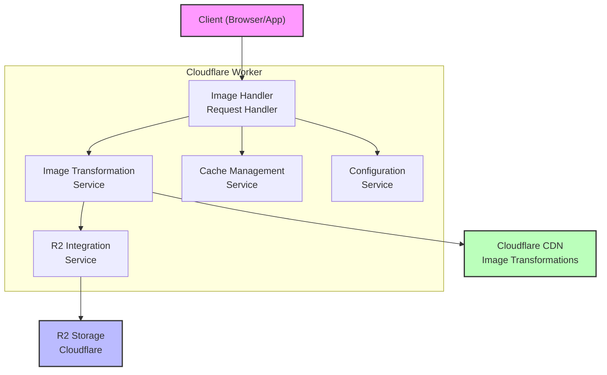
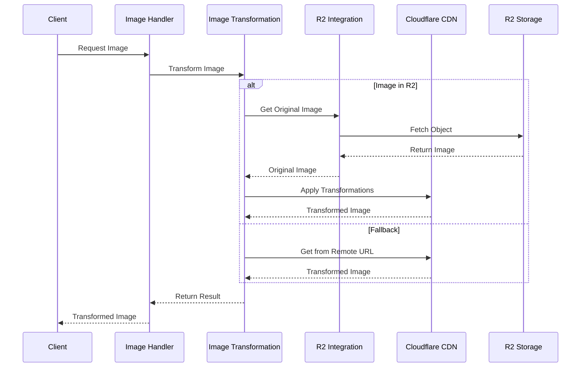
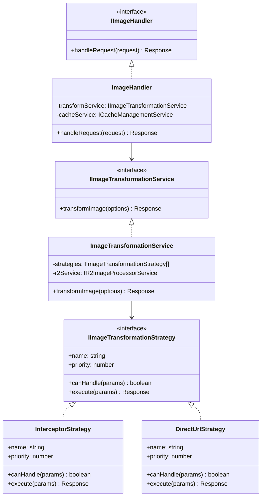

# Architecture Diagrams

This directory contains architectural diagrams for the Image Resizer service, created using Mermaid.

## Diagram Types

- **Component Diagram**: Illustrates the high-level components of the system and their relationships
- **Sequence Diagram**: Shows the interaction between components during request processing
- **Class Diagram**: Displays key classes, interfaces, and their relationships

## Creating or Updating Diagrams

We use [Mermaid](https://mermaid-js.github.io/) for all architecture diagrams because:
- It's version-control friendly (text-based)
- It's directly supported in GitHub markdown
- It's easy to maintain and update
- It ensures consistency across all diagrams

## Example Diagrams

### Component Diagram

### Sequence Diagram

### Class Diagram

## Usage

1. Create your diagram in a Markdown file using the Mermaid syntax
2. Preview it in GitHub or using a Mermaid live editor (https://mermaid.live/)
3. When finalized, generate a PNG export for offline viewing
4. Store both the Markdown source and PNG in this directory
5. Update references in documentation to point to your diagram

## Best Practices

- Keep diagrams simple and focused
- Use consistent styling across all diagrams
- Update diagrams when architecture changes
- Include diagram source code in the repository
- Add comments to explain complex parts