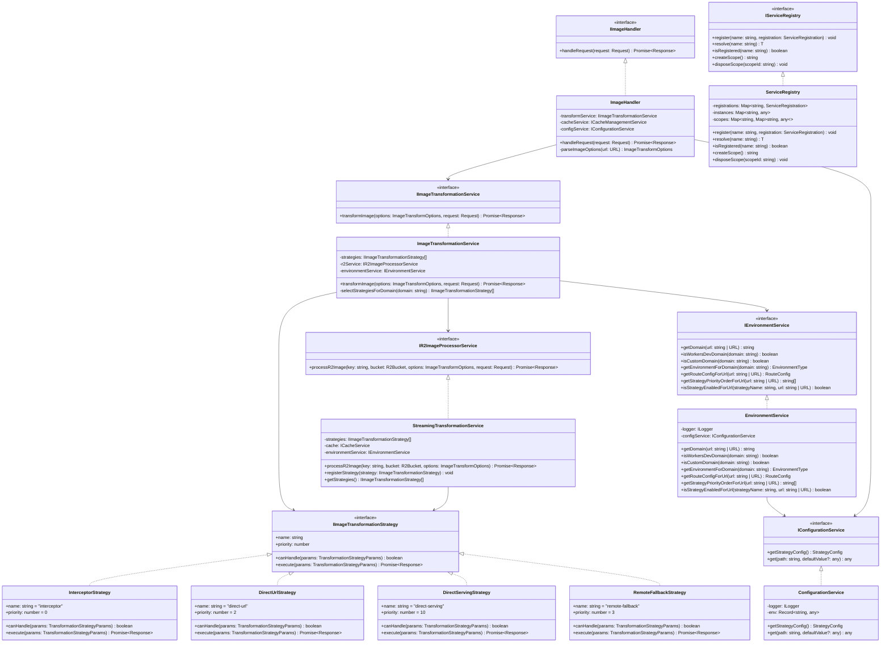

# Class Diagram

This diagram shows the key classes and interfaces in the Image Resizer service and their relationships.

## Class and Interface Descriptions

### Interfaces

- **IImageHandler**: Primary interface for handling image requests
- **IImageTransformationService**: Manages image transformation operations
- **IImageTransformationStrategy**: Strategy pattern interface for different transformation approaches
- **IR2ImageProcessorService**: Handles interaction with R2 storage for image processing
- **IEnvironmentService**: Provides environment and domain-specific configuration
- **IConfigurationService**: Accesses configuration from wrangler.jsonc
- **IServiceRegistry**: Manages service registration and dependency injection

### Implementations

- **ImageHandler**: Main request handler for image processing
- **ImageTransformationService**: Orchestrates image transformation using multiple strategies
- **StreamingTransformationService**: Implements R2 image processing with streaming
- **EnvironmentService**: Provides domain-specific configuration based on URL patterns
- **ConfigurationService**: Manages access to wrangler.jsonc configuration
- **ServiceRegistry**: Implements dependency injection container

### Strategies

- **InterceptorStrategy**: Uses cf.image with subrequest interception (custom domains)
- **DirectUrlStrategy**: Uses direct URLs with cf.image properties (all domains)
- **DirectServingStrategy**: Serves images directly without transformation
- **RemoteFallbackStrategy**: Falls back to remote URLs when other methods fail