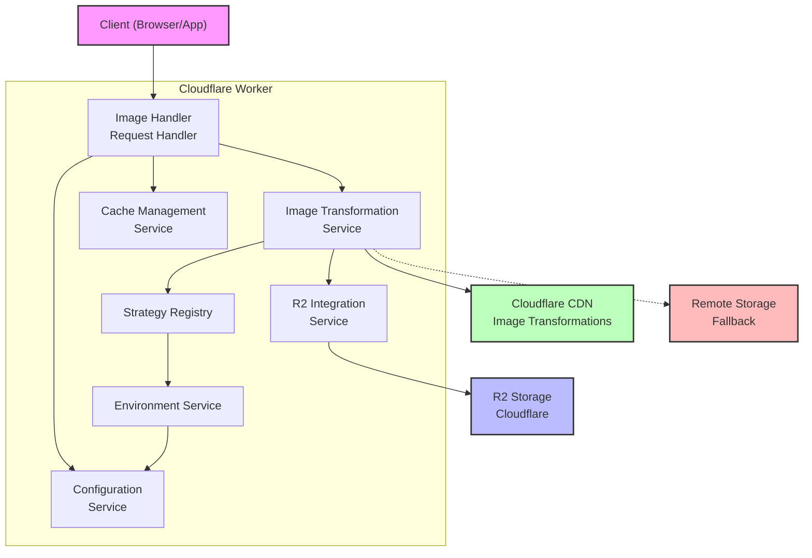

# Component Diagram

This diagram shows the high-level components of the Image Resizer service and their relationships.

## Component Descriptions

### External Components

- **Client**: Web browsers or applications requesting transformed images
- **R2 Storage**: Cloudflare R2 object storage containing original images
- **Cloudflare CDN**: Provides image transformation capabilities via cf.image
- **Remote Storage**: External HTTP source for images when not available in R2

### Internal Components

- **Image Handler**: Main entry point for image requests, routes to appropriate services
- **Image Transformation Service**: Orchestrates image transformation using multiple strategies
- **Cache Management Service**: Handles caching policies and headers
- **Configuration Service**: Provides access to configuration values from wrangler.jsonc
- **R2 Integration Service**: Interacts with Cloudflare R2 storage
- **Strategy Registry**: Manages and prioritizes transformation strategies
- **Environment Service**: Provides environment-specific configuration based on domain