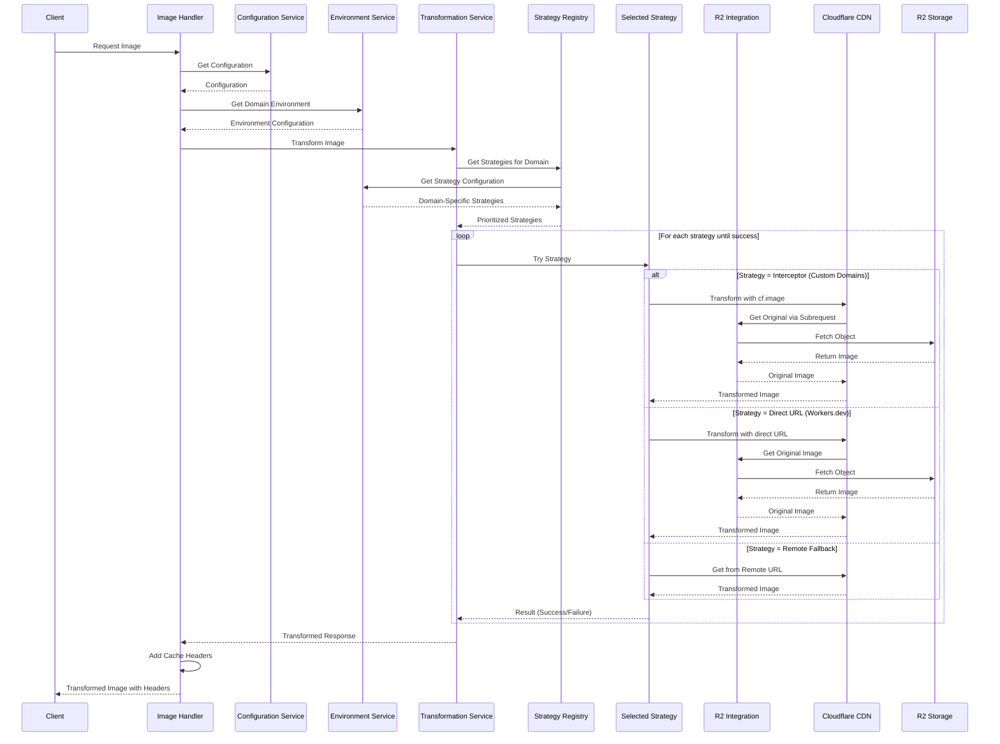

# Sequence Diagram

This diagram illustrates the sequence of interactions when processing an image transformation request.

## Sequence Description

1. **Request Initiation**:
   - Client makes a request for an image with transformation parameters
   - Image Handler processes the request and retrieves configuration

2. **Environment Detection**:
   - Environment Service identifies the domain type (workers.dev vs custom)
   - Strategy configuration is determined based on domain

3. **Strategy Selection**:
   - Strategy Registry provides prioritized strategies for the domain
   - Transformation Service attempts strategies in priority order

4. **Strategy Execution**:
   - For custom domains: Interceptor strategy using cf.image with subrequests
   - For workers.dev domains: Direct URL strategy with cf.image properties
   - Fallback to remote URL if all else fails

5. **Response Processing**:
   - Cache headers and debug information added
   - Transformed image returned to client